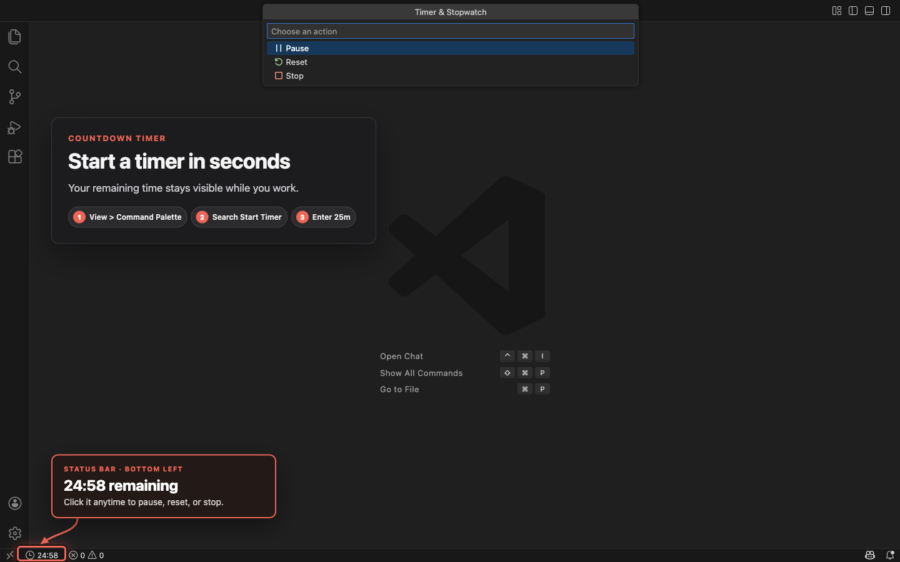
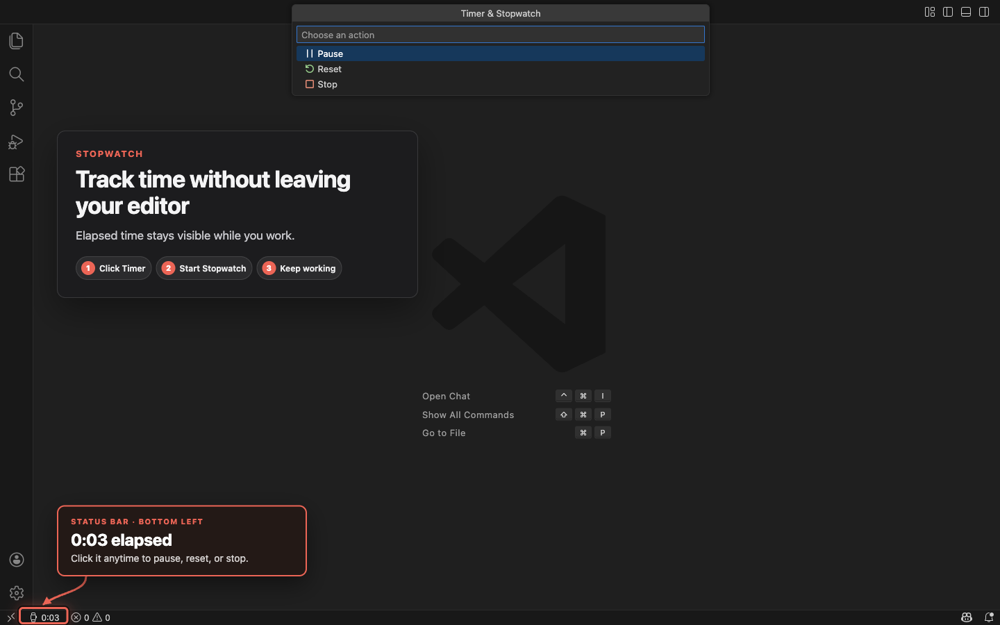

# Timer & Stopwatch

Timer & Stopwatch runs countdown timers and stopwatches from the VS Code status bar. It is published by [Online Alarm Kur](https://onlinealarmkur.com/), keeps the remaining or elapsed time visible while you work, and stores the current session only on your computer.

## Preview

## Quick start

The status bar is the horizontal strip along the bottom of the VS Code window.

1. Find the clock icon followed by **Timer** near the left side of the status bar.
2. Select **Timer**, then select **Start timer**.
3. Enter a duration such as `10m`, then press **Enter**.
4. The status bar changes to `10:00` and begins counting down.

To measure elapsed time instead, select **Start stopwatch**. It starts immediately without asking for a duration.

If **Timer** is not visible, select **View > Command Palette** from the VS Code menu bar, type `Timer & Stopwatch`, and select **Timer & Stopwatch: Start Timer** or **Timer & Stopwatch: Start Stopwatch**.

## Features

- Start a countdown with input such as `25m`, `1h 30m`, or `01:30:00`.
- Start a stopwatch to measure elapsed time.
- See remaining or elapsed time in the status bar.
- Optionally hide the idle **Timer** label while keeping its clock button.
- Pause, resume, reset, or stop from a built-in VS Code menu.
- Hear a short completion beep, with separate controls for sound and notifications.
- Restore the current session when you reopen the same workspace.
- Keep sessions in different workspaces independent.
- Keep all session data local, with no telemetry or workspace inspection.

## Detailed usage

You can start from the VS Code menu or from the status bar.

### Start from the VS Code menu

Use this method if you cannot find **Timer** in the VS Code window:

1. In the VS Code menu bar, select **View > Command Palette**. A searchable list of commands opens.
2. Type `Timer & Stopwatch`.
3. Select **Timer & Stopwatch: Start Timer** or **Timer & Stopwatch: Start Stopwatch**.
4. For a countdown, enter a duration such as `25m`, `1h 30m`, or `01:30:00`, and then press **Enter**. A stopwatch starts immediately without asking for a duration.

The status bar changes from **Timer** to the remaining or elapsed time when the session starts. Your current editor, terminal, or panel keeps focus.

You can also open the Command Palette with **Shift+Command+P** on macOS or **Ctrl+Shift+P** on Windows and Linux.

### Start from the status bar

The status bar is the horizontal strip along the bottom of the VS Code window. After installing the extension, look for a clock icon followed by **Timer** near the left side of that strip.

1. Select **Timer**. A list of timer actions opens near the top of the VS Code window.
2. Select **Start timer** or **Start stopwatch**.
3. For a countdown, enter a duration and press **Enter**. A stopwatch starts immediately.

### Control a running session

After a timer or stopwatch starts, **Timer** changes to the remaining or elapsed time in the status bar.

A running countdown has a clock-face icon. A running stopwatch has a watch icon. A paused session has a pause icon.

1. Select the displayed time.
2. Select **Pause**, **Resume**, **Reset**, or **Stop**.

Reset leaves the session paused. It returns a stopwatch to zero or restores the full countdown duration.

### Countdown formats

- `25m` means 25 minutes.
- `1h 30m` means 1 hour and 30 minutes.
- `01:30:00` means 1 hour and 30 minutes.
- A number without a unit is treated as minutes.
- The minimum countdown is 1 second, and durations use whole-second precision.
- The maximum countdown duration is 30 days.

Each VS Code workspace, meaning the project or folder open in the current window, keeps its own session and restores it when that workspace reopens.

## Countdown completion

When a countdown finishes, its session clears and the status bar returns to **Timer**, or to a clock icon if the idle label is hidden. By default, the extension plays a short beep and shows a VS Code notification with an option to start another timer.

Sound and notifications are independent:

- Disable the beep with the **Play Completion Sound** setting.
- Disable the notification by selecting **Don't show again** when a countdown finishes.
- Preview the beep with the **Timer & Stopwatch: Test Completion Sound** command in the Command Palette.

You can also change these options in VS Code Settings. Select **View > Command Palette**, run **Preferences: Open Settings (UI)**, and search for `Timer & Stopwatch`.

- **Show Idle Label** hides the word **Timer** when nothing is running. The clock button remains visible and active time is never hidden.
- **Play Completion Sound** controls the completion beep.
- **Show Completion Notification** controls the visual notification.

The extension generates its own WAV beep locally. It plays through `afplay` on macOS, PowerShell SoundPlayer on Windows, or the first available supported player on Linux: `paplay`, `aplay`, or `ffplay`. The visual notification appears immediately and does not wait for sound playback.

**VS Code must be open for the extension to notify you immediately.** If a countdown expires while VS Code is closed, its notification appears after you reopen the same workspace.

## Compatibility

- Requires Visual Studio Code 1.125 or newer on desktop.
- Supports macOS through the system `afplay` player.
- Supports Windows through Windows PowerShell and `System.Media.SoundPlayer`.
- Supports Linux when `/usr/bin/paplay`, `/usr/bin/aplay`, or `/usr/bin/ffplay` is installed and connected to a working audio output.
- When you use Remote SSH, WSL, Dev Containers, or desktop Codespaces, the extension runs on your local computer. Its controls and sound therefore remain on your desktop.
- Does not support browser-only VS Code environments such as `vscode.dev` or `github.dev`.

After installation, run **Timer & Stopwatch: Test Completion Sound** from the Command Palette to make sure the beep works. If you hear nothing, check the system volume and selected audio output. On Linux, also confirm that `paplay`, `aplay`, or `ffplay` is installed. The visual notification still works when sound is unavailable.

## Online timer

Need a full-screen timer with multiple alarm sounds and study mode? Use the [Online Alarm Kur timer](https://onlinealarmkur.com/timer/en/).

## Privacy

There is no telemetry, analytics, account, advertising, or project-file inspection. The extension itself makes no network requests. The current session is stored in VS Code's local storage for that workspace, and it holds only the mode, the running or paused status, the duration when one applies, and the timing values needed to restore it.

## License

MIT © Burak Ozdemir
